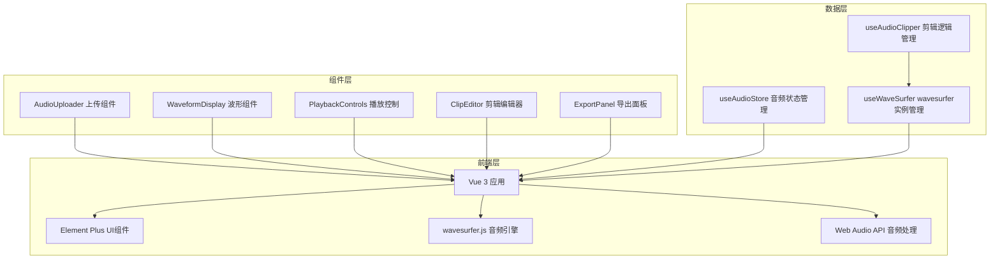

## 1. 架构设计



## 2. 技术说明

- 前端框架：Vue 3@3 + TypeScript + Vite
- UI组件库：Element Plus@2
- 音频可视化：wavesurfer.js@7
- 音频处理：Web Audio API (浏览器原生)
- 状态管理：Pinia
- 样式方案：Tailwind CSS + Element Plus主题定制
- 初始化工具：vite-init (vue-ts 模板)
- 后端：无（纯前端应用，音频处理均在浏览器端完成）

## 3. 路由定义

| 路由 | 用途 |
|------|------|
| / | 主页面，包含所有音频剪辑功能 |

## 4. 组件架构

### 4.1 组件结构

```
src/
├── components/
│   ├── AudioUploader.vue      # 音频文件上传组件
│   ├── WaveformDisplay.vue    # 波形可视化与区域选择组件
│   ├── PlaybackControls.vue   # 播放控制组件
│   ├── ClipToolbar.vue        # 剪辑工具栏组件
│   └── ExportPanel.vue        # 导出下载面板组件
├── composables/
│   ├── useWaveSurfer.ts       # wavesurfer实例管理
│   └── useAudioClipper.ts     # 音频剪辑逻辑
├── stores/
│   └── audio.ts               # 音频状态管理(Pinia)
├── pages/
│   └── Home.vue               # 主页面
├── App.vue
└── main.ts
```

### 4.2 核心Composable设计

**useWaveSurfer**: 封装wavesurfer.js实例的创建、销毁与事件监听
- 初始化wavesurfer实例并绑定DOM容器
- 提供播放/暂停/停止/跳转方法
- 管理Region插件用于区间选择
- 暴露响应式状态：当前时间、总时长、播放状态、缩放级别

**useAudioClipper**: 封装音频剪辑的核心逻辑
- 基于Web Audio API实现音频数据提取与重组
- 提取选中区域：截取start-end区间的音频数据
- 删除选中区域：拼接选中区域前后的音频数据
- 生成WAV Blob用于导出下载
- 操作历史栈支持撤销

## 5. 数据模型

### 5.1 状态模型(Pinia Store)

```typescript
interface AudioState {
  file: File | null
  fileName: string
  duration: number
  currentTime: number
  isPlaying: boolean
  playbackRate: number
  volume: number
  zoomLevel: number
  region: { start: number; end: number } | null
  clipHistory: AudioBuffer[]
  exportFormat: 'wav' | 'mp3'
}
```

### 5.2 音频处理流程

```mermaid
flowchart LR
    "A[File对象]" --> "B[ArrayBuffer]"
    "B" --> "C[AudioContext.decodeAudioData]"
    "C" --> "D[AudioBuffer]"
    "D" --> "E[wavesurfer.load]"
    "D" --> "F[剪辑操作]"
    "F" --> "G[新AudioBuffer]"
    "G" --> "H[encodeWAV]"
    "H" --> "I[Blob下载]"
```
